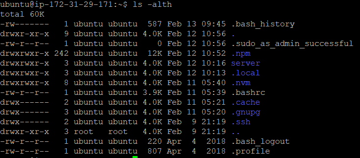

# Belajar Dengan Jenius Linux

## Penulis : Gun Gun Febrianza

## Linux Command Line

Ketika kita membahas *Linux command line*, maka artinya kita sedang membahas **shell**.

Apa sih **Shell** itu? 

**Shell** adalah sebuah program yang berjalan pada sistem operasi yang dapat menerjemahkan perintah dan memproses perintah yang diberikan oleh user. 

Terdapat berbagai **shell**, namun **Bourne Again Shell (Bash)**, sudah disediakan secara *default*. Ketika kita memulai program *shell* maka anda akan melihat simbol dollar ($), yang menandakan  *shell prompt* sudah siap untuk digunakan.

### Command Name

Di bawah ini adalah struktur **command** di dalam **shell** :

**[COMMANDNAME]** OPTIONS ARGUMENTS.

Ketik **whoami** kemudian tekan Enter. Perintah ini akan mencetak nama pengguna sistem operasi **linux** yang sedang menggunakan **shell**.

| Note :                                         |
| ---------------------------------------------- |
| **Linux command** bersifat **case sensitive**. |

Secara konvensi penulisan perintah ditulis menggunakan huruf kecil (**lowercase**). 

Selanjutnya kita akan mencoba perintah dasar yang paling sering digunakan di dalam **shell**. 

Ketik **ls** kemudian tekan enter. Perintah ini akan menampilkan daftar **file** (**lists files**) di dalam suatu **directory**.

### Command Options

Selain perintah juga terdapat opsi perintah atau biasa disebut **command-line options**. Tujuanya digunakan agar perintah yang diberikan memiliki karakteristik tertentu. Untuk memberikan karakteristik perintah kita akan mennggunakan **switches** atau **flags**. 

COMMANDNAME **[OPTIONS]** ARGUMENTS.

**Switches** atau **flags** dimulai dengan strip (**single dash**), atau kita juga bisa menggunakan opsi perintah menggunakan nama kepanjanganya dengan dua strip (**two dash symbols**). Penggunaan **single dash** biasanya menggunakan 1 karakter tunggal sebagai singkatan (**abbreviations**) dari nama kepanjanganya. 

Sebagai contoh di bawah ini terdapat **single-character command-line options** : 

- **-d** artinya **directory**, 
- **-x** for **exclude**, and so on.

Kita sudah mengetahui bahwa perintah **ls** tanpa opsi (**options**) akan memberikan kita informasi berupa daftar **file** yang ada di dalam suatu **directory**. Jika kita menggunakan perintah tersebut dengan **Switches** atau **flags** **-a** seperti :
`ls -a` 
Maka anda telah membuat perintah (**command**) dengan opsi perintah (**command-line option**) untuk pertama kalinya.
Jika kita perhatikan **a** **switch** artinya adalah **all**, dan memberikan karakteristik baru pada perintah **ls** untuk menampilkan seluruh **file** yang ada, termasuk **file** yang tersembunyi. 

Sekarang kita ketik **ls -alth** kemudian tekan enter :

kita dapat memberikan **options** secara berurutan untuk membangun sebuah kombinasi perintah, pada perintah :

`ls -alth` 

1. **-l** **switch** adalah singkatan dari kata **list**, kita akan menampilkan seluruh **file** dengan informasi yang lebih detail.
2. **-t** **switch** adalah singkatan dari kata **time**, kita akan menampilkan **file** secara terurut berdasarkan tanggal modifikasi terbaru.
3. **-h** **switch** adalah singkatan dari kata **human**, kita akan menampilkan ukuran **file** dalam wujud **Mega Byte** (**MB**)  bukan wujud (**Byte**) 

---------------------

