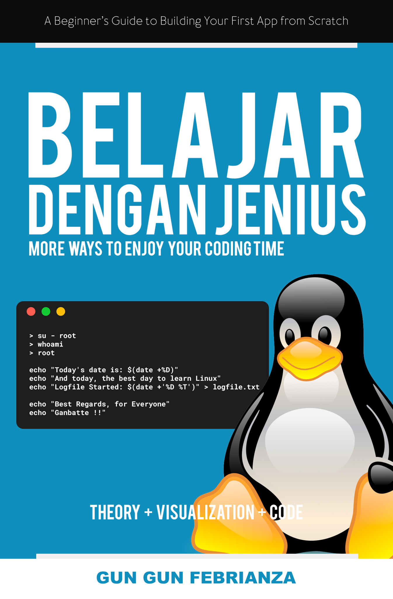

# Belajar Dengan Jenius Linux

## Karya : Gun Gun Febrianza

## Open Library Indonesia

### Table of Contents

Apa itu Linux?

- Apa itu Open Source?
- Apa itu Closed Source?
- Apa itu Kernel?
  - Kernel Architecture
  - Monolithic Kernel
    - Dynamic Linking
  - Microkernel
  - Linux Kernel
  - Linux Distribution
- Apa itu Unix?
  - POSIX Standard
  - MINIX
- Apa itu GNU?
