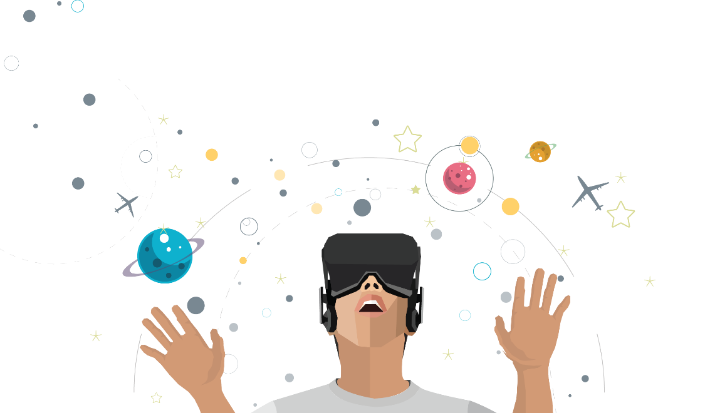
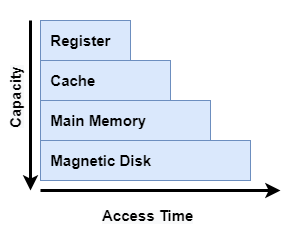

# Belajar Dengan Jenius Linux

## Penulis : Gun Gun Febrianza

# Computer

## Computer Program

Komputer memproses sebuah program yang terdiri dari serangkaian instruksi biner untuk melakukan suatu komputasi (**Computation**) secara spesifik. Kata spesifik mengacu pada suatu **problem domain** atau **programming domain**. 

Menurut **Robert W.Semesta** dalam bukunya yang berjudul **Concept of Programming Language** (2016) sebuah **programming domain** terdiri dari 4 hal yaitu untuk :

**1. Scientific Application**

 Program yang dibuat untuk keperluan sains dan penelitian.

**2. Business Application**

  Program yang dibuat untuk keperluan bisnis.

**3. Artificial Intelligence**

  Program yang dibuat memiliki kemampuan kecerdasan buatan.

**4. Web Software** 

  Program yang dibuat menggunakan teknologi web.

Namun kini kita sudah memasuki era teknologi blockchain sehingga menurut **Gun Gun Febrianza** dalam bukunya yang berjudul Belajar dengan **Jenius Smart Contract & Tokenomics** terdapat dua jenis Applications :

**1. Centralized Applications** 

  Program yang tertanam dalam sistem komputer tersentral, program tidak bersifat transparan dan tidak deterministik.

**2. Decentralized Applications** 

  Program yang tertanam dalam sistem komputer terdesentralisasi, program bersifat transparan dan deterministik.

## Computation

Terdapat dua jenis komputasi yaitu : 

1. Komputasi bisa berupa *numeric computation* seperti memecahkan sesuatu dengan model matematis seperti pada *system of equation* (sistem persamaan) 

2. Dan *symbolic computation* seperti melakukan pencarian pada sebuah teks, memanipulasi teks, gambar dan vidio.

## Computer System

Komputer terdiri dari sekumpulan **hardware** dan **software**, pada **hardware** terdapat beberapa **logical units** seperti :

### Input Unit

Terdiri dari sekumpulan **input device** untuk memproduksi informasi yaitu **keyboard**, **touchscreen**, **webcam**, **microphone**, **barcode scanner** dan **mouse devices.**

### Ouput Unit

Terdiri dari sekumpulan **output device** untuk menampilkan informasi yaitu **screen monitor**, **speaker**, **printer** hingga ke **oculus rift**. 

### Memory Unit

*Memory unit* seringkali disebut **memory**, **primary memory** atau **RAM (Random Access Memory)**. Informasi yang tersimpan dalam **memory unit** bersifat **volatile**, artinya informasi akan hilang jika komputer dimatikan. 

**Memory unit** menjadi tempat untuk mempertahankan informasi setelah melalui **input unit**, sehingga langsung tersedia untuk diproses oleh **processor** jika dibutuhkan untuk memproduksi hasil pada **Ouput Unit**.

#### Memory Hierarchy

Ada berbagai jenis **memory unit** yang disusun berdasarkan **memory hierarchy** yang disusun berdasarkan kapasitas penyimpanan dan waktu akses :

Di bawah ini adalah waktu akses dan kapasitas tipikal untuk setiap memory dalam dalam hirarkinya :
