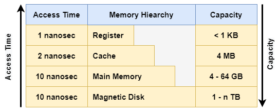

# Belajar Dengan Jenius Linux

## Penulis : Gun Gun Febrianza

# Computer

## Computer Program

Komputer memproses sebuah program yang terdiri dari serangkaian instruksi biner untuk melakukan suatu komputasi (**Computation**) secara spesifik. Kata spesifik mengacu pada suatu **problem domain** atau **programming domain**. 

Menurut **Robert W.Semesta** dalam bukunya yang berjudul **Concept of Programming Language** (2016) sebuah **programming domain** terdiri dari 4 hal yaitu untuk :

**1. Scientific Application**

 Program yang dibuat untuk keperluan sains dan penelitian.

**2. Business Application**

  Program yang dibuat untuk keperluan bisnis.

**3. Artificial Intelligence**

  Program yang dibuat memiliki kemampuan kecerdasan buatan.

**4. Web Software** 

  Program yang dibuat menggunakan teknologi web.

Namun kini kita sudah memasuki era teknologi blockchain sehingga menurut **Gun Gun Febrianza** dalam bukunya yang berjudul Belajar dengan **Jenius Smart Contract & Tokenomics** terdapat dua jenis Applications :

**1. Centralized Applications** 

  Program yang tertanam dalam sistem komputer tersentral, program tidak bersifat transparan dan tidak deterministik.

**2. Decentralized Applications** 

  Program yang tertanam dalam sistem komputer terdesentralisasi, program bersifat transparan dan deterministik.

## Computation

Terdapat dua jenis komputasi yaitu : 

1. Komputasi bisa berupa *numeric computation* seperti memecahkan sesuatu dengan model matematis seperti pada *system of equation* (sistem persamaan) 

2. Dan *symbolic computation* seperti melakukan pencarian pada sebuah teks, memanipulasi teks, gambar dan vidio.

## Computer System

Komputer terdiri dari sekumpulan **hardware** dan **software**, pada **hardware** terdapat beberapa **logical units** seperti :

### Input Unit

Terdiri dari sekumpulan **input device** untuk memproduksi informasi yaitu **keyboard**, **touchscreen**, **webcam**, **microphone**, **barcode scanner** dan **mouse devices.**

### Ouput Unit

Terdiri dari sekumpulan **output device** untuk menampilkan informasi yaitu **screen monitor**, **speaker**, **printer** hingga ke **oculus rift**. 

### Memory Unit

*Memory unit* seringkali disebut **memory**, **primary memory** atau **RAM (Random Access Memory)**. Informasi yang tersimpan dalam **memory unit** bersifat **volatile**, artinya informasi akan hilang jika komputer dimatikan. 

**Memory unit** menjadi tempat untuk mempertahankan informasi setelah melalui **input unit**, sehingga langsung tersedia untuk diproses oleh **processor** jika dibutuhkan untuk memproduksi hasil pada **Ouput Unit**.

#### Memory Hierarchy

Ada berbagai jenis **memory unit** yang disusun berdasarkan **memory hierarchy** yang disusun berdasarkan kapasitas penyimpanan dan waktu akses :

Di bawah ini adalah waktu akses dan kapasitas tipikal untuk setiap memory dalam dalam hirarkinya :

#### Register

Urutan memory paling cepat tentu dipegang oleh register yang letaknya berada di dalam internal sebuah CPU. Di buat dengan material yang sama dengan CPU, didesain secepat CPU sehingga tidak ada delay sama sekali untuk waktu akses. 

Hanya saja kapasitasnya terbatas baik untuk 32-64 bit CPU terdapat kapasitas kurang dari 1KB.

#### Cache Memory

Cache memory di control secara penuh oleh hardware, main memory dibagi menjadi beberapa baris cache (Cache Lines) dengan ukuran typical 64 bytes. 

Dimulai dari address 0 sampai 63 pada baris cache 0, kemudian address 64-127 pada baris cache 1 dan seterusnya.

### Central Processing Unit (CPU)

*CPU* (**Central Processing Unit**) adalah istilah yang diberikan jika hanya terdapat 1 processor yang dimiliki oleh suatu komputer. 

#### Processor

Industri komputer menggunakan istilah terminologi **Central Processing Unit** pada awal tahun 1960, namun secara tradisional terminologi **CPU** mengacu pada sebutan untuk **processor**. 

Seluruh **modern CPU** adalah **Microprocessor** yang berarti mereka tersimpan di dalam sebuah chip tunggal **Integrated Circuit.** 

**Processor** adalah sebuah otak dari komputer yang mengendalikan operasi berbagai komponen dalam sistem komputer. Sebuah **CPU** membutuhkan dua hal yaitu program atau aplikasi dan data. 

#### Arithmetic & Logic Unit (ALU)

Fungsi dari **ALU** adalah untuk melakukan kalkulasi seperti penjumlahan, pengurangan, perkalian dan pembagian. 

**ALU** memiliki mekanisme untuk membuat keputusan yang dapat membuat komputer misal, membandingkan dua buah data dalam **memori unit** apakah data tersebut setara (**equal**) atau tidak. 

Kini ALU (**Arithmetic and Logic Unit**) dikembangkan sebagai **next logical unit** untuk **CPU**.

#### Von Neumann Architecture

Desain operasional dasar sebuah sistem komputer disebut dengan **architecture**. Seluruh arsitektur komputer yang ada saat ini tidak lepas dari seorang pioner komputer bernama **John von Neumann**. 

Dalam sebuah sistem *Von Neumann* terdapat tiga komponen utama yaitu **Central Processing Unit** (**CPU**), **physical memory**, dan **input** atau **output** (IO). **Central Processing Unit** (**CPU**) akan menerima data dari **memory** dan **input**. 

Elemen kunci dari **Von Neumann Architecture (VNA)** adalah :

1. Data & Instruksi disimpan dalam bilangan biner (**binary**).
2. Data & Instruksi disimpan dalam main **memory**.
3. Instruksi diambil (**fetched**) dari **memory** satu persatu dalam satu waktu secara berurutan.
4. **Processor** melakukan **decode** pada instruksi dan mengeksekusinya sebelum mengambil instruksi selanjutnya.
5. Aktivitas ini terus dilakukan sampai tidak ada lagi instruksi yang tersedia.

Dalam **Von Neumann Architecture (VNA)** dalam sebuah **processor** terdapat 5 spesial **register** :

**1.**  **Program Counter (PC)**

Menyimpan **memory address** dari instruksi selanjutnya yang akan diambil dari **main memory**.

**2.**  **Memory Address Register (MAR)**

Menyimpan **memory address** dari instruksi saat ini yang sedang dieksekusi. 

**3.**  **Memory Buffer Register (MBR)**

Menyimpan data yang akan ditransfer menuju **main memory**.

**4.**  **Current Instruction Register (CIR)**

Menyimpan instruksi yang saat ini telah di **decode** dan di eksekusi.

**5.**  **Accumulator (ACC)**

Menyimpan data yang telah diproses, hasil dari sebuah komputasi. 

#### CPU Register

Fungsi dasar **CPU** adalah melakukan **fetch**, **decode**, dan **execute** setiap instruksi bahasa mesin yang berada di dalam **Read-only Memory (ROM)** ataupun **Random Access Memory (RAM)**.

**CPU** akan melakukan **fetch data** dari sebuah memori eksternal dan mengirimkanya kedalam **internal memory** yang disebut dengan **register**.

**Register** adalah sebuah **high-speed memory** yang ada di dalam internal **CPU**. **Register** digunakan **processor** untuk menyimpan sebuah hasil komputasi sementara yang ukurannya terbatas. Data yang tersimpan dapat berupa : 

1. Alamat dari instruksi bahasa mesin selanjutnya yang akan dieksekusi.
2. Instruksi bahasa mesin saat ini yang sedang di **decode**.
3. Hasil komputasi.

#### Instruction Set Architecture (ISA)

Sebuah **CPU** memiliki kemampuan untuk memahami perintah yang disebut dengan **machine instruction** dan setiap **CPU** memiliki **instruction set architecture (ISA)** yang berbeda-beda. 

Program yang didesain untuk **x86 Processor** tidak dapat dieksekusi pada **ARM Processor**, begitu juga sebaliknya.

**Instruction Set Architecture** adalah spesifikasi formal sebuah **CPU**, bagaimana sebuah **CPU** berinteraksi dengan **memory**, dan kapabilitas **I/O**. 

#### Moore's Laws

Berdasarkan **Moore’s Law** setiap 18 bulan sekali total **transistor** dalam **Central Processing Unit (CPU)** meningkat dua kali lipat. **Central Processing Unit (CPU)** mampu menampung lebih banyak **transistor** dan ukuranya semakin kecil.

**Gordon Moore** adalah seorang **Intel Cofounder** yang telah melakukan observasi **Moore’s Law**.

#### Multi-core Processor

Kebanyakan komputer hari ini telah memiliki lebih dari satu **CPU** sehingga dapat melakukan banyak sekali operasi secara simultan. Sebuah **Multi-core processor** memiliki lebih dari satu **processor** dalam satu **IC Chip** tunggal. 

Sebagai contoh **dual-core processor** artinya terdapat dua ***processor\*** dalam 1 **IC Chip** dan **quad-core** artinya terdapat 4 **processor** dalam **1 IC Chip.** Beberapa **processors** seperti **Intel Xeon Phi** dan **Tilera TilePro** memiliki lebih dari **60 cores** dalam **1 IC Chip**.

#### Multi-core Programming

Ada fakta yang menarik, seluruh bahasa pemrograman pupolar yang ada saat ini tidak didesain untuk bisa memanfaatkan **multiple CPU Core (Multicore)**. 

Bahasa pemrograman seperti **Go** telah di desain oleh para **legend** seperti **Robert**, **Rob** dan **Ken** agar kita dapat menulis **parallel** dan **concurrent code** secara aman. Sehingga kita dapat memanfatkan keuntungan **modern multicore CPU** dan **Cloud Computing**. 

Transformasi **performance computer** terus mengalami perubahan, dengan kondisi **status quo** dunia komputer saat ini. Hari ini berdiskusi mengenai kecepatan artinya bagaimana kita bisa memanfaatkan konsep **parallel** atau **concurrency**. Kenapa bisa begitu? 

Di bawah ini adalah opini penulis, ada beberapa faktor kenapa **multi-core programming** akan membawa standar dan tren pemrograman di masa depan :

1. Ingat **Moore’s Law** Effect.
2. Setiap 18 bulan sekali kecepatan **Central Processing Unit (CPU)** terus meningkat dua kali lipat, dimulai dari semenjak tahun 1950.
3. Namun setelah 50 tahun lebih, tepatnya pada tahun 2002 terdapat batasan dalam desain sirkuit **Central Processing Unit (CPU),** menuntut adanya arsitektur baru.
4. Solusi atas permasalahan di atas adalah **multi-core processor**, setelah tahun 2002 dalam satu **chip** bisa terdapat 2 **core**, 4 **core**, 8 **core** lebih **processor**.
5. Namun pada masing-masing **core** tidak mengalami peningkatan kecepatan, hanya kuantitas **core** saja yang bertambah. Hukum **Moore law** masih berjalan, bukan lagi dengan menambah **transistor** dalam **Central Processing Unit (CPU)** tetapi menambah **core** dalam 1 **chip** tunggal.
6. **Chip manufacturer** mulai berhenti menambah **transistor**, **trend** mulai berfokus menambahkan **core** dan **cache**. Namun menambah jumlah **core** juga terbatas pada **cost** secara **economic**.
7. Menambah jumlah **cache** juga pada akhirnya akan menemukan batasan, **the bigger the cache, the slower it gets**.
8. Dari permasalahan di atas, jelas kita tidak bisa lagi mengandalkan inovasi peningkatan **hardware** melainkan bagaimana cara membangun **software development** yang efisien.
9. Berdasarkan keadaan **status quo** industri **chip** saat ini, para **software engineer** harus memanfaatkan **multicore processor** dengan konsep **concurrency** untuk memaksimalkan kapabilitas **hardware**.

