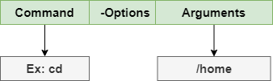
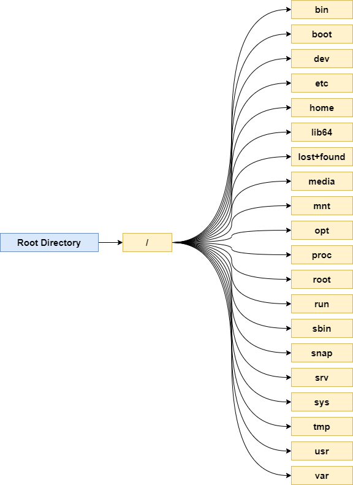
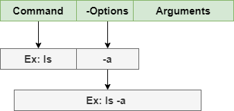
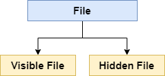
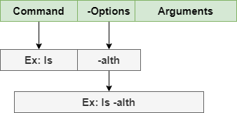
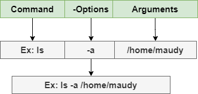

# Belajar Dengan Jenius Linux

## Penulis : Gun Gun Febrianza

# Linux Command Line

Ketika kita membahas ***Linux command line***, maka artinya kita sedang membahas **shell**. **Linux shell** seringkali disebut **bash shell** yang kepanjangannya adalah **Bourne Again Shell**, yang diciptakan oleh **Stephen Bourne** saat menciptakan **shell** untuk sistem operasi **UNIX**.

Bash menjadi shell standar untuk seluruh **linux distribution**, namun shell lainnya juga tersedia seperti **C shell** (**csh**), **Korn shell** (**ksh**), **ash** **Shell** dan sebagainya. Bab ini akan fokus membahas penggunaan **bash shell** saja. 

## Apa itu Shell?

**Shell** adalah sebuah program interpreter yang menunggu perintah (**Command**), menerjemahkan perintah dan memproses perintah yang diberikan oleh user. 

Ketika kita memulai program ***shell*** maka anda akan melihat simbol dollar ($), yang menandakan  *shell prompt* sudah siap untuk digunakan.

```bash
~$
```

Di bawah ini adalah struktur **command** di dalam **shell** :


Perintah (**Command**) pertama yang akan kita pelajari adalah **echo**, silahkan eksekusi perintah di bawah ini : 

```bash
~$ echo hello maudy
hello maudy
~$ echo hello world
hello world
```

## Apa itu Command?

**Command** adalah perintah yang akan kita berikan agar dieksekusi oleh **shell**. Untuk menguji perintah pertama kita, ketik perintah (**Command**) pada shell prompt **whoami** kemudian tekan Enter. 


Perintah (**Command**) ini digunakan untuk mencetak nama pengguna sistem operasi **linux** yang sedang menggunakan **shell**. **Linux command** bersifat **case sensitive**.

Secara konvensi penulisan perintah (Command) ditulis menggunakan huruf kecil (lowercase). Selanjutnya kita akan mencoba perintah dasar yang paling sering digunakan di dalam *shell*.

### Present Working Directory


Untuk mengetahui saat ini kita berada di posisi **directory** yang mana eksekusi perintah (**command**) **pwd** kemudian tekan enter.

```bash
~$ pwd
/home/ubuntu
```

Kita akan mencoba untuk pindah **directory** menuju **/home directory** menggunakan perintah (**command**) **cd**.

### Change Directory



Untuk berpindah **directory** eksekusi perintah **cd /home** kemudian tekan enter.

```bash
~$ cd  /home
/home$ 
```

Seketika kita langsung berpindah **directory**.

### Root Directory

Untuk berpindah menuju root directory agar bisa melihat struktur filesystem linux eksekusi perintah cd / kemudian tekan enter.

```bash
~$ cd /
/$
```

Perhatikan posisi **Present Working Directory** (**PWD**) saat ini berada di dalam **root directory** yang ditandai dengan **path xxx@xxx : /$**.

### List Directory Content

Untuk melihat terdapat **directory** apa saja eksekusi perintah **ls** kemudian tekan enter. 

```bash
~$ /$ ls
bin   home            lib64       opt   sbin  tmp      vmlinuz.old
boot  initrd.img      lost+found  proc  snap  usr
dev   initrd.img.old  media       root  srv   var
etc   lib             mnt         run   sys   vmlinuz

```

Perintah ini akan menampilkan daftar file (*lists files*) di dalam suatu *directory*.



Jika kita ubah kedalam tampilan visual kita bisa melihat terdapat banyak sekali sub-directory di dalam root directory. Kita akan membahas masing-masing **directory** di bab khusus.

Jika anda ingin mengetahui penjelasan setiap **directories**, eksekusi perintah di bawah ini :

```bash
~$ man hier
```

Menggunakan perintah **change directory** yaitu **cd** kita bisa mengeksplorasi setiap **directory** di atas, silahkan lakukan sendiri untuk latihan dan eksplorasi. Untuk membaca posisi anda saat ini gunakan perintah **pwd**.

Jika anda merasa tersesat eksekusi perintah di bawah ini :

```bash
~$ cd ~ 
```

Anda akan kembali lagi di halaman **/home/ubuntu**.

### Path Directory

Pada sistem operasi **linux** alamat (**path**) dari directory menggunakan simbol **forward slash (/)** dan pada sistem operasi **windows** menggunakan simbol **backward slash (\)**.

### Absolute & Relative Path

Selain memahami konsep **path directory** pada **linux** yang mengunakan simbol **forward slash (/)**, kita juga harus memahami konsep **absolute path** dan **relative path**. 

Pada **absolute path**, alamat (**path**) ditulis secara lengkap misal **/home/ubuntu**

```bash
~$ cd /home/ubuntu
```

Pada **relative path** alamat tidak ditulis dengan lengkap, misal jika kita melakukan **change directory** menuju **/var directory** :

```bash
~$ cd /var
```

Selanjutnya kita dapat menggunakan alamat (**path**) **log/cloud-init.log** di dalam **var directory** tanpa perlu mengeksekusi menggunakan **full path /var/log/cloud-init.log**.Jadi jika perintah (**command**) di atas tidak menampilkan **output** apapun berarti dalam **directory** tersebut tidak terdapat **visible file** sama sekali.

Untuk melihat **hidden file** kita akan mempelajarinya di halaman selanjutnya, untuk itu pastikan kita kembali melakukan navigasi menuju **directory home/ubuntu** :

```bash
/$ cd home/ubuntu
~$
```

## Apa itu Command Options?

Setelah mempelajari **Command** (Perintah) kita akan mempelajari **options** atau **command-line options** (Opsi Perintah).


Opsi perintah atau biasa disebut **command-line options** digunakan agar perintah (**Command**) yang dieksekusi memiliki karakteristik tertentu. Untuk memberikan karakteristik perintah kita perlu menggunakan **switches** atau **flags**. 



Pada perintah di atas kita menggunakan **switches -a** untuk melihat seluruh **file** termasuk **hidden file**. Perintah di atas akan memproduksi **output** berupa sekumpulan **hidden files** yang ditandai dengan ciri awalan nama **file** menggunakan simbol **dot (.)** :

```bash
~$ ls -a
.   .bash_history  .bashrc  .gnupg    .ssh
..  .bash_logout   .cache   .profile  .sudo_as_admin_successful
```

### Hidden File

Pada sistem operasi **linux** kita dapat membuat **file** yang terlihat (**visible file**) dan **file** yang tersembunyi (h**idden file**).



Perintah (command) ls digunakan untuk menampilkan daftar file yang terlihat saja (visible file) sementara command ls dengan options -a membantu kita melihat hidden file.

### Current Directory & Parrent Directory

Simbol dot (.) artinya kita sedang berada dalam sebuah directory dan double dot (..) menandakan terdapat sebuah parent directory.


### Switches

**Switches** atau **flags** dimulai dengan strip (**single dash**\), atau kita juga bisa menggunakan opsi perintah menggunakan nama kepanjanganya dengan dua strip (**two dash symbols**).

Penggunaan **single dash** biasanya menggunakan 1 karakter tunggal sebagai singkatan (**abbreviations**) dari nama kepanjanganya. Sebagai contoh di bawah ini terdapat **single**-**character command-line options** : 

-  -a (**single dash**) atau **--all** (**two dash**)
- -l (**single dash**) atau **--list** (**two dash**)
- -t (single dash) atau **--time** (**two dash**)
- -h (**single dash**) atau **--human** (**two dash**)

Kita dapat menggunakan lebih dari satu **options** dalam satu perintah (**Command**) untuk mendapatkan karakteristik lainnya. 



Sebagai contoh eksekusi perintah (**Command**) ini **ls -alth** kemudian tekan enter :

```bash
~$ ls -alth
total 36K
drwxr-xr-x 5 ubuntu ubuntu 4.0K Mar 15 04:53 .
-rw------- 1 ubuntu ubuntu   32 Mar 15 04:53 .bash_history
-rw-r--r-- 1 ubuntu ubuntu    0 Mar 15 04:53 .sudo_as_admin_successful
drwx------ 2 ubuntu ubuntu 4.0K Mar 15 01:01 .cache
drwx------ 3 ubuntu ubuntu 4.0K Mar 15 01:01 .gnupg
drwx------ 2 ubuntu ubuntu 4.0K Mar 14 19:41 .ssh
drwxr-xr-x 3 root   root   4.0K Mar 14 19:41 ..
-rw-r--r-- 1 ubuntu ubuntu  220 Apr  4  2018 .bash_logout
-rw-r--r-- 1 ubuntu ubuntu 3.7K Apr  4  2018 .bashrc
-rw-r--r-- 1 ubuntu ubuntu  807 Apr  4  2018 .profile
```

Fungsi dari masing-masing **switch** :

- **Option -l switch** memberikan karakteristik pada perintah untuk menampilkan seluruh file dalam bentuk list lengkap dengan detil informasi lainnya seperti waktu pembuatan file (creation date). 
- **Option -t switch** memberikan karakteristik pada perintah untuk mensortir file berdasarkan waktu modifikasi (modification date) dimulai dari yang terbaru diurutan paling atas/awal. 
- **Option -h** stands memberikan karakteristik **human readable,** output akan menampilkan ukuran file yang lebih mudah dibaca dalam satuan Mega Bytes (MB) bukan dalam satuan bytes. 

## Apa itu Command Arguments?

**Arguments** adalah informasi yang menjadi input untuk diproses sebuah **command**, sebelumnya kita sudah menggunakan **arguments**. Di bawah ini contoh **Command**, **Options** dan **Arguments** secara lengkap :



Selanjutnya kita akan belajar bagaimana membuat sebuah **file**, mengubah **modification time**, dan **access time file** dengan memanfaatkan **command argument**.

### Touch Command
