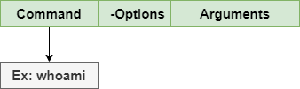

# Belajar Dengan Jenius Linux

## Penulis : Gun Gun Febrianza

# Linux Command Line

Ketika kita membahas ***Linux command line***, maka artinya kita sedang membahas **shell**. **Linux shell** seringkali disebut **bash shell** yang kepanjangannya adalah **Bourne Again Shell**, yang diciptakan oleh **Stephen Bourne** saat menciptakan **shell** untuk sistem operasi **UNIX**.

Bash menjadi shell standar untuk seluruh **linux distribution**, namun shell lainnya juga tersedia seperti **C shell** (**csh**), **Korn shell** (**ksh**), **ash** **Shell** dan sebagainya. Bab ini akan fokus membahas penggunaan **bash shell** saja. 

## Apa itu Shell?

**Shell** adalah sebuah program interpreter yang menunggu perintah (**Command**), menerjemahkan perintah dan memproses perintah yang diberikan oleh user. 

Ketika kita memulai program ***shell*** maka anda akan melihat simbol dollar ($), yang menandakan  *shell prompt* sudah siap untuk digunakan.

```bash
~$
```

Di bawah ini adalah struktur **command** di dalam **shell** :


Perintah (**Command**) pertama yang akan kita pelajari adalah **echo**, silahkan eksekusi perintah di bawah ini : 

```bash
~$ echo hello maudy
hello maudy
~$ echo hello world
hello world
```

## Apa itu Command?

**Command** adalah perintah yang akan kita berikan agar dieksekusi oleh **shell**. Untuk menguji perintah pertama kita, ketik perintah (**Command**) pada shell prompt **whoami** kemudian tekan Enter. 



Perintah (**Command**) ini digunakan untuk mencetak nama pengguna sistem operasi **linux** yang sedang menggunakan **shell**. **Linux command** bersifat **case sensitive**.

Secara konvensi penulisan perintah (Command) ditulis menggunakan huruf kecil (lowercase). Selanjutnya kita akan mencoba perintah dasar yang paling sering digunakan di dalam *shell*.

### Present Working Directory


Untuk mengetahui saat ini kita berada di posisi **directory** yang mana eksekusi perintah (**command**) **pwd** kemudian tekan enter.

```bash
~$ pwd
/home/ubuntu
```

Kita akan mencoba untuk pindah directory menuju /home directory menggunakan perintah (command) cd
