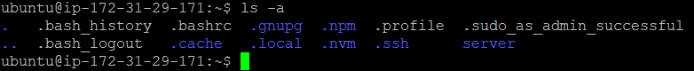
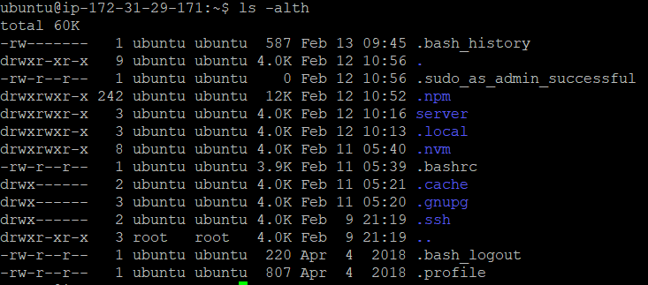

# Belajar Dengan Jenius Linux

## Penulis : Gun Gun Febrianza

## Linux Command Line

Ketika kita membahas **Linux Command-line**, artinya kita sedang membahas bagaimana cara untuk berinteraksi dengan linux melalui perintah-perintah yang kita berikan melalui **shell**.

### Shell

Apa sih **Shell** itu? 

**Shell** adalah sebuah **user interface** yang dapat kita gunakan secara interaktif untuk mengeksekusi perintah pada sistem **linux**. Pada **GNU/Linux system** secara **default** perintah pada **shell** akan diterjemahkan oleh **Bash**.

###  Bash

**Bash** adalah program **interpreter** pada sistem **linux** yang dapat menterjemahkan dan memproses perintah (**command**) yang diberikan oleh user. 

Terdapat berbagai **shell**, seperti **csh**, **tcsh** namun pada kesempatan kali ini penulis menggunakan **Bourne Again Shell (Bash)**. Ketika kita memulai program **shell** maka anda akan melihat simbol **dollar** ($), yang menandakan  **shell prompt** sudah siap untuk digunakan.

### Scripting

**Script** terdiri dari sebuah perintah tunggal (**Single Command**) atau serangkaian perintah (**Sequence of Commands**) yang disimpan menjadi sebuah **file**. Sebuah **interpreter** akan menterjemahkan setiap perintah di dalam **script**. Segala sesuatu yang dapat kita lakukan di dalam **command-line** juga dapat dilakukan di dalam **script**, dengan cara menulis perintah-perintah yang ingin dieksekusi ke dalam sebuah **script file**.  Hal ini membuat **script** sangat cocok untuk melakukan **automation**, mengeksekusi sekumpulan perintah secara otomatis. Ketika hal ini dilakukan maka kita sedang melakukan **scripting**.

### Command Name

Di bawah ini adalah struktur **command** di dalam **shell** :

> **[COMMANDNAME]** OPTIONS ARGUMENTS.

#### whoami

Kita akan mempelajari beberapa perintah dasar yang menarik untuk dicoba. Eksekusi perintah (**command**) di bawah ini :

```bash
whoami
```

Perintah di atas akan mencetak nama pengguna sistem **linux** yang sedang menggunakan **shell**.

| Note :                                         |
| ---------------------------------------------- |
| **Linux command** bersifat **case sensitive**. |

#### date

Eksekusi perintah (**command**) di bawah ini :

```bash
date
```

Perintah di atas akan mencetak tanggal pada sistem **linux**. 

#### cal

Eksekusi perintah (**command**) di bawah ini :

```bash
cal
```

Perintah di atas akan mencetak kalender pada sistem **linux**. 

#### pwd

Eksekusi perintah (**command**) di bawah ini :

```bash
pwd
```

Perintah di atas akan mencetak **present working directory** pada sistem **linux**. 

| Note :                                                       |
| ------------------------------------------------------------ |
| Secara konvensi penulisan perintah ditulis menggunakan huruf kecil (**lowercase**). |

#### ls

Eksekusi perintah (**command**) di bawah ini :

```bash
ls
```

Perintah di atas akan menampilkan daftar **file** (**list files**) di dalam suatu **directory**.

### Command Option

Selain nama perintah (**Command Name**) juga terdapat opsi perintah atau biasa disebut **command-line options**. 

Tujuanya digunakan agar perintah yang diberikan memiliki karakteristik tertentu. Untuk memberikan karakteristik perintah kita harus menggunakan sebuah **switches** atau **flags**. 

> COMMANDNAME **[OPTIONS]** ARGUMENTS.
>

**Switches** atau **flags** dimulai dengan strip (**single dash**), atau menggunakan nama kepanjanganya dengan dua strip (**two dash symbols**). Penggunaan **single dash** biasanya menggunakan 1 karakter tunggal sebagai singkatan (**abbreviations**) dari nama kepanjanganya. 

Sebagai contoh di bawah ini terdapat **single-character command-line options** : 

- **-d** artinya **directory**, 
- **-x** for **exclude**, and so on.

Kita sudah mengetahui bahwa perintah **ls** tanpa opsi (**options**) akan memberikan kita informasi berupa daftar **file** yang ada di dalam suatu **directory**. Jika kita menggunakan perintah tersebut dengan **Switches** atau **flags** **-a** seperti :

```bash
ls -a
```

Maka anda telah membuat perintah (**command**) dengan opsi perintah (**command-line option**) untuk pertama kalinya.
Jika kita perhatikan **a** **switch** artinya adalah **all**, dan memberikan karakteristik baru pada perintah **ls** untuk menampilkan seluruh **file** yang ada, termasuk **file** yang tersembunyi. 



Sekarang kita ketik **ls -alth** kemudian tekan enter :



kita dapat memberikan **options** secara berurutan untuk membangun sebuah kombinasi perintah, pada perintah :

```bash
ls -alth
```

1. **-l** **switch** adalah singkatan dari kata **list**, kita akan menampilkan seluruh **file** dengan informasi yang lebih detail.
2. **-t** **switch** adalah singkatan dari kata **time**, kita akan menampilkan **file** secara terurut berdasarkan tanggal modifikasi terbaru.
3. **-h** **switch** adalah singkatan dari kata **human**, kita akan menampilkan ukuran **file** dalam wujud **Mega Byte** (**MB**)  bukan wujud (**Byte**) 

### Command Argument

//Todo

---------------------

