# Belajar Dengan Jenius Linux

## Penulis : Gun Gun Febrianza

# Linux Text Editor

**Linux** memiliki filosopi, segala sesuatu dalam **linux** adalah direpresentasikan dalam sebuah **file**. **Hardisk**, **Keyboard**, **Mouse**, dan **Printer** direpresentasikan dalam sebuah **file**. Proses yang sedang berjalan juga direpresentasikan dalam sebuah **file**.

Sehingga seorang **System Administrator** dalam **Linux** waktunya dihabiskan dengan memodifikasi dan observasi **file**. Sehingga mereka sangat cekatan dalam menggunakan **text editor**.

Jika anda menggunakan **Linux Dekstop** yang mendukung tampilan **user interface** berbasis **GUI**, anda bisa menggunakan **GNOME** atau **KDE**. Pada **GNOME** sudah tersedia program bernama **gedit** dan pada **KDE** terdapat **kate**.

Untuk membuka sebuah **file text** menggunakan **gedit** eksekusi perintah di bawah ini :

```
~$ gedit suratcinta.txt
```

Begitu juga dengan **kate** untuk membuka **file text** eksekusi perintah dibawah ini :

```bash
~$ kate suratcinta.txt
```

Semuanya tergantung **linux distribution** yang anda gunakan.

Namun jika anda menggunakan **Ubuntu Linux** pada layanan **cloud** seperti **Amazon EC2**, kita harus terbiasa dengan **command-line editor** seperti **nano** dan **vi**.

## Nano Editor

**Nano editor** adalah **editor** yang sangat cocok untuk pemula.

### Create Text

Untuk menggunakan **nano editor** eksekusi perintah di bawah ini :

```bash
~$ nano
```

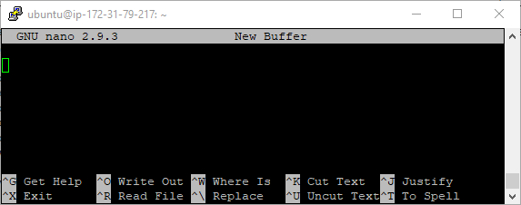

Selanjutnya silahkan ketik beberapa kalimat :

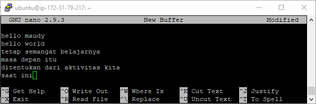

Disinilah tempat kita akan membuat sebuah teks berbasis **command-line editor** menggunakan **nano**.

### Save Text

Jika anda lihat terdapat beberapa informasi short cut yang dapat anda gunakan untuk memproses teks di atas.

| Nano Shortcut | Penjelasan                                        |
| ------------- | ------------------------------------------------- |
| CTRL + O      | Simpan teks yang telah kita tulis (**Write Out**) |

Untuk menyimpan **file** tekan **CTRL+O**, selanjutnya anda akan dihadapkan untuk memberi nama **file** yang akan anda simpan seperti pada gambar di bawah ini :

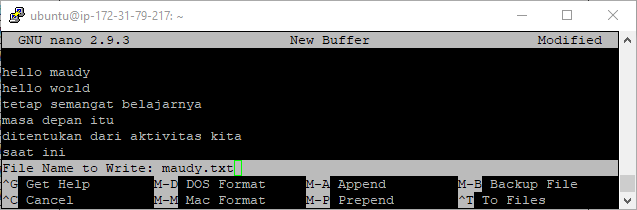

Untuk keluar dari **editor** tekan tombol **CTRL+X**.

| Nano Shortcut | Penjelasan              |
| ------------- | ----------------------- |
| CTRL + X      | Keluar dari kode editor |

Selanjutnya kita dapat melihat **file** yang sudah kita buat dengan mengeksekusi perintah di bawah ini :

```bash
~$ ls -l
…
-rw-rw-r-- 1 ubuntu ubuntu  105 Mar 26 15:20 maudy.txt
…
```

Terdapat **file** yang telah kita buat yaitu **maudy.txt**.

### Open Text

Untuk membuka sebuah **file** menggunakan **nano** eksekusi perintah di bawah ini :

```bash
~$ nano maudy.txt
```

Maka **nano editor** akan membuka **file maudy.txt**.

### Replace Text

Jika kita ingin mengganti (**replace**) sebuah kata menggunakan **nano** tekan CTRL + \.

| Nano Shortcut | Penjelasan                           |
| ------------- | ------------------------------------ |
| CTRL + \      | Mengganti (**Replace**) sebuah kata. |

Selanjutnya **nano editor** akan meminta anda mengisi kata apa yang ingin kita ganti (**replace**), pada gambar di bawah ini penulis ingin mengganti kata **world** dengan gun.

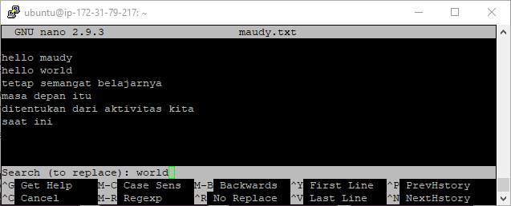

Tekan enter, kemudian masukan gun.

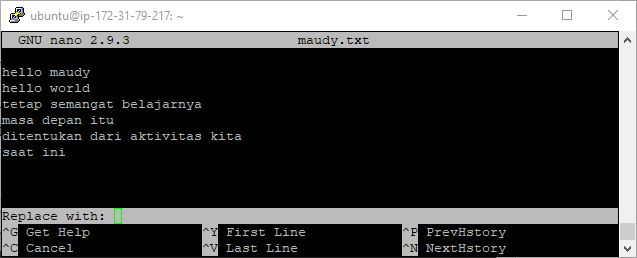

**Nano editor** akan mencari kata tersebut ada pada baris keberapa dan meminta anda untuk mengkonfirmasinya apakah akan menggantinya atau tidak seperti pada gambar di bawah ini :

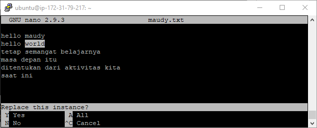

Tekan tombol Y untuk menyetujui dan enter.

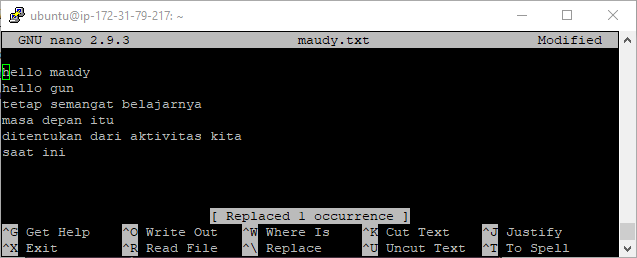

Informasi terkait berapa kata yang sudah kita ganti (**replace**) juga akan ditampilkan seperti pada gambar di atas.

--------------


## Vi Editor

**Vi editor** adalah **editor** yang sangat direkomendasikan untuk pengguna **linux** dengan mobilitas tinggi dan profesional. Terdapat banyak sekali fitur yang disediakan dalam **vi editor** jika dibandingkan **nano editor**.

Untuk membuka sebuah **file** menggunakan vi editor eksekusi perintah di bawah ini :

```bash
~$ vi maudy.txt
```

Di bawah ini adalah tampilan **command-line editor** menggunakan **vi** :

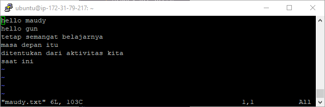

Terdapat dua mode yang harus anda ketahui saat menggunakan **vi editor** yaitu :

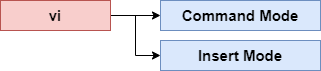

Secara **default** saat anda menjalankan **vi** anda sedang berada dalam **Command Mode**, pada **command mode** anda dapat melakukan aktivitas seperti **copy**, **paste**, **delete**, **search**, **replace** dan sebagainya.

### Insert Mode

Pada Insert Mode kita dapat menyisipkan teks kedalam file, untuk memasuki insert mode terdapat beberapa keys yang harus kita ketahui. Sekumpulan huruf yang akan kita gunakan untuk memanipulasi teks dalam vi editor.

Jika anda ingin menambahkan garis baru di baris terakhir, gunakan arrow down pada keyboard seperti gambar di bawah ini :

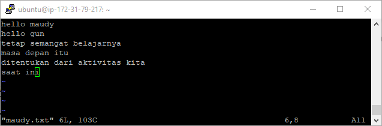

Kemudian tekan huruf o kecil, kemudian tulis kalimat semangat! atau apapun itu..

| Vi Insert Key | Penjelasan                                                 |
| ------------- | ---------------------------------------------------------- |
| o             | Menambahkan garis baru (**new line**) di baris selanjutnya |
| O             | Menambahkan garis baru (**new line**) di baris sebelumnya  |

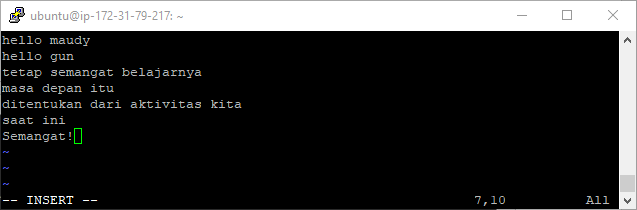

Selanjutnya tekan tombol **ESC** jika ingin kembali ke **Command Mode**.

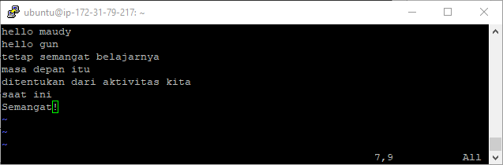

Jika anda ingin menambahkan teks sebelum **cursor** tepatnya sebelum tanda seru, gunakan huruf i kecil.

| Vi Insert Key | Penjelasan                                      |
| ------------- | ----------------------------------------------- |
| i             | Menambahkan teks sebelum posisi cursor saat ini |
| I             | Menambahkan teks di awal baris cursor saat ini  |

Tambahkan kalimat Gun! Atau nama anda sendiri sebagai latihan..

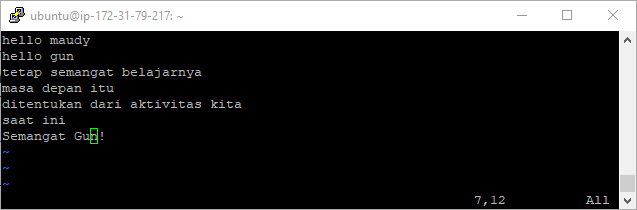

Jika sudah kembali ke **Command Mode** dengan menekan tombol **ESC**.

Kebalikan dari i dan I adalah a dan A

| Vi Insert Key | Penjelasan                                          |
| ------------- | --------------------------------------------------- |
| a             | Menambahkan teks setelah posisi **cursor** saat ini |
| A             | Menambahkan teks di akhir baris **cursor** saat ini |

Silahkan anda coba untuk berlatih menggunakan **vi editor**.

-------


### Command Mode

#### **Copy & Paste**

Selain fitur menambahkan teks semuanya ada pada **Command Mode**, kita akan mencoba aktivitas **copy & paste** menggunakan **vi editor**. 

| Vi COmmand Keys | Penjelasan                                       |
| --------------- | ------------------------------------------------ |
| yy              | Menyalin satu baris sesuai dengan posisi kursor. |
| 2yy             | Menyalin dua baris sejak dari posisi kursor      |
| p               | Paste setelah posisi kursor                      |
| P               | Paste sebelum posisi kursor (P kapital)          |

--------


#### **Undo**

Untuk melakukan undo tekan tombol u.

| Vi COmmand Keys | Penjelasan                               |
| --------------- | ---------------------------------------- |
| u               | Undo perubahan terakhir.                 |
| U               | Undo seluruh perubahan pada suatu baris. |

Untuk menyalin sebuah kalimat saja **vi** memiliki **Command key** yang unik.

------


#### **Copy Words**

Jika anda ingin menyalin satu kalimat saja setelah posisi kursor gunakan **Command Key** di bawah ini :

| Vi COmmand Keys | Penjelasan                                        |
| --------------- | ------------------------------------------------- |
| yw              | Menyalin satu kalimat dimulai dari posisi kursor. |
| 2yw             | Menyalin dua kalimat dimulai dari posisi kursor   |

Untuk melakukan **cut** baris dan kalimat **vi** menggunakan **command key** berikut :

| Vi COmmand Keys | Penjelasan                                   |
| --------------- | -------------------------------------------- |
| dd              | Cut satu baris dimulai dari posisi kursor.   |
| 3dd             | Cut tiga baris dimulai dari posisi kursor.   |
| dw              | Cut satu kalimat dimulai dari posisi kursor. |

-----


#### **Delete**

Jika anda ingin menghapus karakter tekan tombol x, anda bisa melakukannya sekali atau berkali-kali untuk menghapus sebuah **string** :

| Vi COmmand Key | Penjelasan                                          |
| -------------- | --------------------------------------------------- |
| x              | Menghapus satu karakter dimulai dari posisi kursor. |

-----

#### **Search**

Jika anda ingin mencari sebuah kalimat tekan simbol /, selanjutnya ketik kalimat yang ingin anda cari :

| Vi COmmand Key | Penjelasan              |
| -------------- | ----------------------- |
| /              | Mencari sebuah kalimat. |

-----


#### **Search** & Replace

Untuk melakukan pencarian dan **replace** eksekusi perintah di bawah ini :

| Vi COmmand Key    | Penjelasan                                         |
| ----------------- | -------------------------------------------------- |
| :%s/gun/febrianza | Mencari kata gun dan mengubahnya menjadi febrianza |

Kita akan mencoba mengubah kata gun menjadi febrianza :

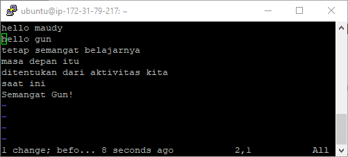

Di bawah ini adalah hasil dari **Search & Replace** :

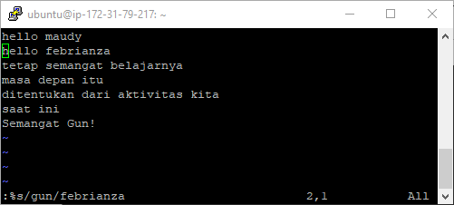

-------


**Jump**

Untuk loncat ke baris tertentu gunakan simbol : diikuti nomor baris tujuan anda 

| Vi COmmand Key | Penjelasan               |
| -------------- | ------------------------ |
| :4             | Kursor menuju baris ke 4 |

Untuk menampilkan dan menyembunyikan line number dalam **vi editor** perhatikan **command key** di bawah ini :

| Vi COmmand Key | Penjelasan                                         |
| -------------- | -------------------------------------------------- |
| :set number    | Menampilkan line number dalam vi editor            |
| :set nonumber  | Menyembunyikan kembali line number dalam vi editor |

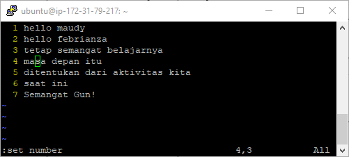

Untuk loncat ke baris terakhir teks tekan huruf G (kapital) dan untuk loncat ke baris pertama kode tekan gg.

| Vi COmmand Key | Penjelasan                         |
| -------------- | ---------------------------------- |
| G              | Kursor menuju baris terakhir teks. |
| gg             | Kursor menuju baris awal teks.     |

-----


#### **Save**

Untuk menyimpan **file** perintahnya sebagai berikut : 

| Vi COmmand Key | Penjelasan                                       |
| -------------- | ------------------------------------------------ |
| :w             | Simpan **file** tanpa keluar dari **vi editor**. |
| :wq            | Simpan **file** lalu keluar dari **vi editor**.  |

----


#### **Exit**

Untuk keluar dari **vi editor** perintahnya sebagai berikut : 

| Vi COmmand Key | Penjelasan                                                   |
| -------------- | ------------------------------------------------------------ |
| :q             | Keluar dari **vi editor** tanpa menyimpan perubahan.         |
| :q!            | Keluar dari **vi editor** tanpa menyimpan perubahan. (Force Mode) |

----


## View Mode

Ada saatnya kita hanya ingin melihat **file** saja, **linux** menyediakan beberapa perintah yang dapat kita gunakan untuk **view mode**.

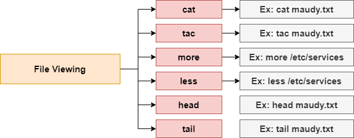

#### cat Command 

Perintah (**Command**) **cat** sering kali digunakan untuk memeriksa **file** dengan cepat, di bawah ini kita menggunakan perintah (**Command**) **cat** untuk membaca **file** :

