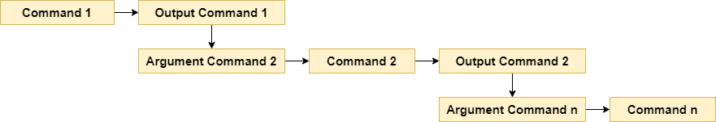

# Belajar Dengan Jenius Linux

## Penulis : Gun Gun Febrianza

## Linux Pipe

---------------------

**Linux** menyediakan konsep **pipe**, sebuah konsep bagaimana membuat **output** dari sebuah perintah (**Command**) bisa menjadi **input argument** bagi perintah (**Command**) lainnya. Ilustrasinya dapat anda lihat pada gambar di bawah ini : 



Pada pembahasan **linux editor** kita telah membuat **file maudy.txt** dan belajar bagaimana caranya melihat konten suatu file dengan perintah **cat**, **tac**, **more**, **less**, **head** dan **tail**.

Sekarang jika anda diuji untuk menampilkan 5 baris pertama dari **file maudy.txt**, kemudian mengambil (**extract**) 2 baris terakhir dari 5 baris tersebut. Bagaimana caranya? Dalam linux kita dapat menggunakan konsep **linux pipe**.

Untuk melakukanya perhatikan perintah di bawah ini :

```bash
~$ head -n 5 maudy.txt | tail -n 3
tetap semangat belajarnya
masa depan itu
ditentukan dari aktivitas kita

```

