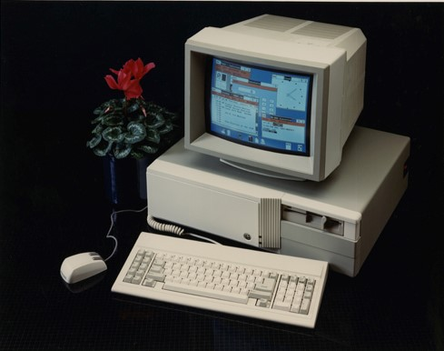
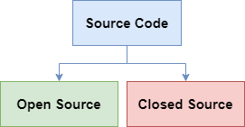
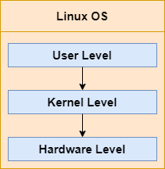
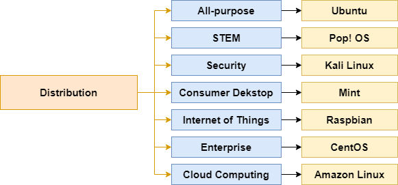

# Belajar Dengan Jenius Linux

## Penulis : Gun Gun Febrianza

# Apa itu Linux ?

Pada tahun 1991 seorang mahasiswa lulusan dari **Universitas Helsinki** dari Finlandia mulai menulis sistem operasi gratis (**free operating system**) sebagai hobi. Sebuah hobi yang kelak akan menjadi sejarah besar kemajuan peradaban teknologi.

**Linus Torvald** mengawali pembangunan **UNIX like kernel** untuk **IBM PC (Intel 80386) Architecture** [1]. Sebuah **personal computer** zaman dulu :

Pengembangan awal dilakukan pada tahun 1991, di tahun itu **linux** pertama kali di posting melalui internet, pembangunan **linux kernel** melalui proses yang panjang dan rumit.

Pengembangan linux kernel bisa terwujud berkat kolaborasi para ahli yang dikendalikan secara terpusat oleh Linus Torvald. Kontribusi kode dari para ahli di atasi menggunakan sebuah mailing list yaitu **LKML (Linux Kernel Mailing List)**.

**Linus** berkontribusi besar dalam meningkatkan kualitas **linux** agar bisa **up-to-date** dengan berbagai pengembangan **hardware device** dan berkoordinasi dengan ribuan para ahli lainnya untuk mengembangkan **linux** dari seluruh dunia.

Selama bertahun-tahun para pengembang berhasil membuat **linux** tersedia di beberapa arsitektur seperti **Hewlett-packard Alpha**, **Intel’s Itanium**, **AMD’s AMD64**, **PowerPC** dan **IBM’s zSeries**. 

Sistem operasi yang dibuat bersifat **open source** dan menjadi proyek **open source** terbesar dalam sejarah dunia **software engineering**. **Project open source** tersebut kini dikenal dengan sebutan **linux**.

## Apa itu Open Source?

**Open Source** artinya kode pemrogramannya tersedia untuk publik, sehingga kita dapat melihat kode pemrogrammannya dan memodifikasinya sesuai kebutuhan kita. Kita juga bisa ikut mengembangkan kode pemrograman tersebut agar bisa menjadi lebih baik dan dapat digunakan oleh orang lain dalam satu **codebase**. 

## Apa itu Closed Source?

Closed Source adalah sebuah project yang kode pemrogramannya bersifat privat, tidak tersedia untuk publik karena memiliki nilai komersil.

OS Linux bersifat open source dan OS Windows bersifat closed source.

## Apa itu Kernel?

Kernel adalah inti dari sebuah sistem operasi, yang menjadi layer perantara antara software dan hardware. Kernel melayani permintaan (request) dari sebuah aplikasi (arbitrary application) agar bisa berinteraksi dengan hardware.

Pada gambar di atas, pada user level seorang pengguna akan berinteraksi dengan sebuah application, sebuah application dapat memberikan perintah pada kernel. 

Misal, kernel harus berinteraksi dengan hardisk, maka harus ditentukan path mana yang akan digunakan untuk menyalin data dari disk ke memory. Kernel juga bisa dikatakan sebagai sebuah library yang menyediakan berbagai perintah untuk mengelola sistem. 

Kernel akan dimuat kedalam RAM saat system boots dan memiliki banyak sekali procedure yang digunakan untuk membuat sistem dapat beroperasi. Setelah kernel dimuat kedalam RAM, service bisa disediakan untuk sistem dan user. Beberapa servis berjalan diluar lingkup kernel space.

### Kernel Architecture

Ada 2 arsitektur pengembangan kernel yang dominan yaitu kernel secara :

1. Monolithic dan 
2. Microkernel. 

Sebagian besar UNIX-kernel menggunakan arsitektur monolithic, begitu juga Linux Kernel yang dibangun Linus Torvald juga di desain secara **monolithic**. 

### Monolithic Kernel

Monolithic kernel artinya seluruh fungsionalitas sebuah sistem operasi secara virtual direpresentasikan dalam sebuah block of code tunggal dan berjalan sebagai process tunggal dengan address space tunggal.

Monolithic kernel adalah konsep tradisional yang sudah lama digunakan, pada monolithic kernel seluruh subsystem seperti memory management, file management dan device driver tersimpan dalam satu codebase tunggal.

Sebagai process tunggal monolithic kernel memiliki internal data structure dan routines yang dapat digunakan untuk memberikan berbagai fungsionalitas.

#### Dynamic Linking

Monolithic kernel memiliki keunggulan secara performance dibandingkan dengan microkernel. Linux Kernel didesain menggunakan arsitektur monolithic kernel dan telah mendukung konsep **Dynamic Linking**. 

Dengan Dynamic Linking sekumpulan modules dengan kernel code dapat dimuat dan dicabut kedalam kernel kapan saja dalam keadaan runtime. Pemasangan modules untuk memberikan tambahan fungsionalitas.

### Microkernel

//todo

### Linux Kernel

Secara technical, linux adalah sebuah UNIX-like Kernel. Linux sebagai UNIX-like kernel tidak menyediakan komponen lainnya yang dapat membentuk sebuah sistem operasi yang utuh.

Untuk menjadi sebuah sistem operasi yang utuh linux kernel memerlukan komponen lainnya seperti core utilities, text-editor, compiler, user interface, dan sebagainya.

Namun karena semua komponen tersebut tersedia secara free dengan lisensi GPL pada akhirnya siapapun dapat menggunakan linux kernel untuk membuat sebuah sistem operasi yang disebut dengan linux.

Linux Kernel atau UNIX-like kernel yang dikembangkan Linus Torvald dibangun menggunakan GNU Toolchain. Linus Torvald menulis kernel pertama, sambil membaca buku yang berjudul The Design of UNIX Operating System.

Saat linux kernel mencapai versi 2.6, linux kernel sudah sesuai dengan kaidah IEEE POSIX Standard. Artinya setiap UNIX Program dapat dikompilasi dan dieksekusi dalam lingkungan linux system.

Untuk mendukung pembangunan Modern Operating System, Linux Kernel mendukung fitur-fitur seperti virtual memory, virtual filesystem, lightweight processes, unix signals, SVR4 interprocess communications, symmetric multiprocessor system dan masih banyak lagi. 

Saat ini tepatnya pada tahun 2021, Linux kernel telah mencapai versi 5.11 dengan 30 juta baris code lebih.

Sebagai catatan, selain Linux-kernel yang dibuat Linus Torvald juga terdapat alternatif open source UNIX Kernel lainnya seperti :

1. FreeBSD
2. NetBSD
3. OpenBSD

-------------

### Linux Distribution

**Linux** sebenarnya adalah sebuah **kernel**, bukan sebuah sistem operasi yang siap digunakan. 

Untuk menyempurnakan linux agar menjadi sebuah sistem operasi yang dapat digunakan, kita memerlukan sekumpulan program (*bundling program*) yang kita kenal sebagai **distribution**.

Saat ini terdapat ratusan **linux distribution** yang dapat anda pantau di :

[www.distrowatch.com](http://www.distrowatch.com)

Ada berbagai distribution masing-masing memiliki tujuan, untuk tujuan umum kita dapat menggunakan Ubuntu, untuk riset STEM menggunakan Pop!OS, untuk keamanan dan pentesting dapat menggunakan kali linux dan sebagainya.

Karena linux bersifat free dan open source siapapun dapat membangun versi distributionnya sendiri. Selain free & open source linux distribution juga terdapat versi linux distribution komersil untuk enterprise seperti red hat enterprise linux server.

-------

## Apa itu Unix?

Unix adalah sebuah sistem operasi yang di kembangkan di AT&T Bell Labs sejak tahun 70an oleh Ken Thompson, Dennis Ritchie dan kawan-kawan. Awalnya ditulis menggunakan bahasa assembly, selanjutnya ditulis ulang ditulis menggunakan bahasa C.

Pengembangan sistem operasi UNIX memberikan kemajuan terkait teori-teori bagaimana cara mendesain sistem operasi yang baik dan teori-teori software engineering, seperti konsep modularity dan reusability untuk pembangunan sistem operasi.

Pada akhir tahun 70an sampai 80an UNIX menjadi pusat kajian didunia penelitian, akademi, hingga tumbuhnya perkembangan sistem operasi UNIX untuk tujuan komersil dan bisnis.

Awalnya UNIX bersifat closed source, lisensi source code bisa didapatkan dengan cara melakukan perjanjian dengan pemiliknya yaitu AT&T. Lisensi pertama UNIX dijual pertama kali untuk University of Illinois sekitar tahun 1975.

Pengembangan UNIX terus berlanjut hingga pada tahun 1979 Berkeley Software Distribution (BSD) dipublikasikan dengan tambahan program yang kini sangat populer oleh Bill Joy. Program tersebut adalah vi dan C Shell.

BSD menjadi salah satu popular branch dalam UNIX family dan terdapat fenomena menarik yaitu UNIX War, terjadi pada tahun akhir 80an sampai dengan awal 90an. UNIX war adalah kompetisi antar vendor menawarkan UNIX Computer.

Kompetisi tersebut memberikan kemajuan pada peradaban sistem operasi komputer, standarisasi sistem operasi yang baik dan benar jadi arus utama. Pada tahun 1988, POSIX Standard lahir.

### POSIX Standard

POSIX (Portable Operating System Interface) standard membantu pengembang software agar dapat memastikan program yang dibangun dapat di port ke sistem operasi UNIX lainnya. 

POSIX membangun bahasa universal terkait bagaimana cara berinteraksi dengan API (Application Programming Interface).

### MINIX

Meskipun source code UNIX tersedia namun ukurannya sangat besar dan rumit dalam konteks usaha untuk memahami. Seseorang kemungkinan akan memahami kesulitan untuk mempelajari source code UNIX.

Andrew S Tanenbaum berusaha membangun sebuah UNIX-like system yang lebih mudah difahami, dengan cara membangun versi minimum yang dapat dijadikan sebagai kerangka dasar agar mudah difahami.

Sistem terdiri dari 11.800 baris bahasa C & 800 baris bahasa assembly yang dipublikasikan sekitar tahun 1987. Secara fungsionalitas hampir setara dengan UNIX pada versi ke 7.

MINIX adalah UNIX-like system yang dibangun pertama kali dengan pendekatan arsitektur microkernel. 

Kernel terdiri dari 1600 baris bahasa C dan 800 baris bahasa assembly. Pembangunan dilakukan untuk komputer dengan arsitektur 8088, sehingga untuk membangun I/O Device driver diperlukan 2900 baris bahasa C, 5.100 baris bahasa C untuk file system dan 2.200 baris bahasa C untuk memory manager.

Kelebihan dari desain microkernel dari monolithic kernel adalah kemudahan untuk difahami dan dipelihara karena strukturnya yang modular. Kekurangannya adalah performance akan berjalan rendah akibat aktivitas switching antara user mode dan kernel mode.

MINIX didesain seminimal mungkin sehingga untuk dunia akademia dapat dimanfaatkan agar para mahasiswa-mahasiswi bisa mempelajarinya dalam kurun waktu satu semester.

Jika sebuah sistem operasi di desain mirip dengan UNIX maka disebut dengan UNIX-Like Operating System.

Ciri dari sistem operasi UNIX adalah :

1. Kernel

   Core sistem operasi

2. Shell

   Sebuah program interpreter yang dapat menerjemahkan perintah yang diberikan oleh user. Baik sistem operasi UNIX dan UNIX-like tersedia beberapa shell seperti sh (Bourne Shell), bash (Bourne again shell), csh (C Shell), tcsh (TENEX C Shell), ksh (Korn Shell) dan zsh (Z Shell).

3. Filesystem

   Baik sistem operasi UNIX dan UNIX-like menyediakan struktur directory yang bersifat hierarchy dan segala sesuatunya diperlakukan sebagai file.

4. Development Environment

   Baik sistem operasi UNIX dan UNIX-like menyediakan tools dan libraries untuk menulis, melakukan kompilasi, dan debugging menggunakan bahasa C & C++.

5. Command

   Baik sistem operasi UNIX dan UNIX-like menyediakan standard utilities yang menjadi core untuk editting text, membuat file, manajemen program, process dan membaca data sistem dan user.

6. Documentation

   Sebuah manual book untuk mendapatkan informasi lebih lanjut terkait perintah, system calls dan libraries yang tersedia dalam sistem operasi.

## Apa itu GNU?

GNU bukanlah UNIX, GNU (GNU is Not Unix). GNU atau The GNU Project adalah proyek pembangunan sistem operasi berbasis Unix-like yang bersifat free software. Project ini telah dimulai sejak tahun 1984.

Terminologi Free Software mengacu pada kebebasan (Freedom) bukan harga atau nilai moneter (price). Kebebasan (Freedom) disini bermakna luas, bebas menjalankan software, menyalin, mendistribusikan dan memodifikasi source code dari software tersebut.

Kebebasan disini juga bermakna kita bisa saja membayar atau tidak membayar sama sekali untuk setiap penggunaan GNU Software. Tergantung kesepakatan antara penyedia GNU Software dan pihak yang membutuhkan.

Pada Tahun 1971, Richard Stallman memulai karirnya di MIT bekerja di dalam grup yang menggunakan free software secara berlebihan sehingga menimbulkan ketergantungan. 

Pada masa itu perusahaan-perusahaan komputer sering mendistribusikan free software dan para programmer juga secara bebas untuk berkolaborasi dengan programmer lainnya.

Namun pada tahun 80an, hampir sebagian besar software bersifat proprietary yang artinya sebuah software ada pemiliknya secara legal, ada usaha privatisasi. Hal ini yang menjadi driver lahirnya The GNU Project. 

Sistem operasi yang bersifat free software menjadi kunci fundamental yang harus diperjuangkan, agar pengguna tidak selalu bergantung pada sistem operasi yang bersifat proprietary software.

Richard Stallman dan kawan-kawan berusaha membuat sistem operasi yang kompatibel dengan sistem operasi UNIX. Dikarenakan sistem operasi UNIX secara desain sudah di anggap proven. 

Compatibility menjadi poin penting agar pengguna dapat melakukan switching dari sistem operasi UNIX ke GNU dan dari GNU ke UNIX dengan mudah. 

---------------

### GNU/Linux System

Pada tahun 1985 Richard Stallman membangun Free Software Foundation (FSF). Tujuan dari Free Software Foundation (FSF) adalah membantu membiayai pembangunan sistem operasi GNU yang mirip dengan UNIX (UNIX-like Operating System).

Pendanaan diperlukan sebagai insentif karena ada banyak sekali komponen yang harus dibangun seperti kernel, compiler, editor, graphical interface, text-formatter, libraries, games dan sebagainya.

Pada tahun 1990 seluruh komponen untuk membuat sistem operasi berhasil dibangun kecuali satu komponen yaitu kernel. Pada tahun 1991 Linus Torvald berhasil membangun sebuah kernel yang mirip dengan UNIX (UNIX-like kernel), kernel tersebut diberi nama linux.

Hadirnya linux kernel menjadi poin penting dalam sejarah karena mengisi komponen yang hilang dalam pembentukan sistem operasi. Kombinasi dari GNU system dan linux kernel akhirnya berhasil membentuk sebuah sistem operasi komplit. 

Kombinasi keduanya di sebut dengan GNU/Linux system. Pada GNU/Linux system segala sesuatu yang tidak free tidak termasuk kedalam kategori. 

Linux-libre bisa mengacu pada dua hal pertama sebuah konseptual dan yang kedua komponen kernel, pada level konseptual linux-libre artinya kernel tidak boleh mengandung obfucasted code atau source code yang mengandung proprietary licenses.

Pada level komponen linux-libre adalah sebuah kernel yang menjadi pelengkap GNU system untuk membangun sebuah sistem operasi secara lengkap dan utuh. Linux-libre adalah versi modifikasi dari linux kernel yang dibuat oleh linus torvald.

**Linux** adalah sebuah **kernel**, bukan sebuah sistem operasi yang siap digunakan. 

Untuk menyempurnakan **linux** agar menjadi sebuah sistem operasi yang dapat digunakan, kita memerlukan sekumpulan program (***bundling program***) yang kita kenal sebagai **distribution**\.

| Purpose                                   | Distribution           |
| ----------------------------------------- | ---------------------- |
| Umum                                      | Ubuntu                 |
| Keamanan Komputer (**Computer Security**) | Kali Linux             |
| Perusahaan (**Enterprise**)               | CentOS                 |
| Komputasi Awan (**Cloud Computing**)      | Amazon Linux (AWS AMI) |

**Distribution** **linux** di atas bisa didapatkan dengan gratis. 

Di dalamnya terdapat ribuan ***program*** dan **software** yang bisa digunakan secara gratis. Sebagian besar program tersebut bersifat **open source**, kita dapat melihat kode sumber dari program tersebut, mempelajarinya dan memodifikasinya sesuai dengan kebutuhan kita. 

---------------------

