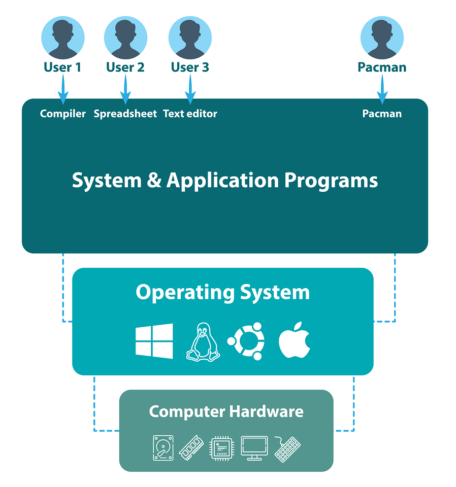
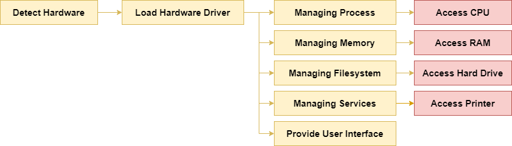
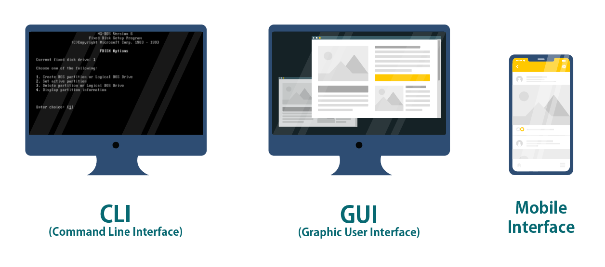
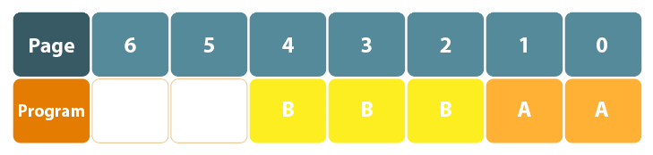
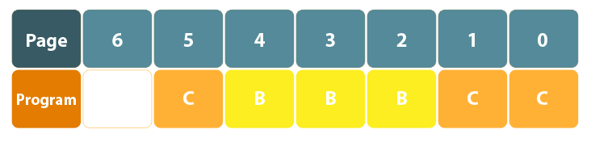

# Belajar Dengan Jenius Linux

## Penulis : Gun Gun Febrianza

# Operating System

## Apa itu OS (Operating System) ?

Sistem operasi adalah sekumpulan program yang mengendalikan perangkat keras (**hardware**) komputer dan sumber perangkat lunak (**software**) yang ada di dalamnya. 

Saat kita menyalakan komputer sistem operasi **linux** akan melakukan **boots up**, seluruh komponen **hardware** akan dibaca lalu memuat **driver** dari masing-masing **hardware** tersebut agar dapat digunakan.

Langkah selanjutnya adalah memanajemen **process**, **memory**, **filesystem**, **services** dan **user interface** :

**Managing Process**

Selanjutnya sistem operasi akan memanajemen sekumpulan **process** dalam waktu bersamaan, kapan dan mana saja **process** yang akan diakses **CPU**. Sistem operasi memiliki kemampuan untuk menjalankan, memberhentikan dan mengubah prioritas proses (**process**) yang harus di dahulukan.

**Managing Memory**

Setiap aplikasi membutuhkan alokasi **memory** yang harus di atur oleh sistem operasi.

**Managing Filesystem**

Sistem operasi menyediakan struktur penyimpanan data untuk **file** dan **directory** dan **ownership** untuk setiap **file** dan **directory**.

**Managing Services**

Sistem operasi menyediakan akses untuk menggunakan perangkat lainnya misal akses pada mesin printer. Sistem operasi akan menyediakan sebuah **daemon process** yang berjalan dibelakang (**background**) sistem, menanti permintaan (**request**) yang akan kita berikan.

**Provide User Interface**

Setiap sistem operasi juga menyediakan **interface** yang dapat kita gunakan untuk mengelola sistem operasi. Ada 3 macam **user interface** diantaranya adalah :

1. **Graphical User Interface(GUI)**
2. **Command-line Interface (CLI)**
3. **Mobile User Interface (Mobile UI)**

Selanjutnya sistem operasi menyediakan 5 **managements** utama diantaranya adalah :

### Processor Management

Pada sistem operasi kita dapat melakukan **multitasking** yaitu mengeksekusi lebih dari satu program sekaligus (simultan). Sebagai contoh kita dapat membuka program untuk mengelola dokumen, melakukan **streaming** musik dan program lainnya.

**Multitasking** dapat dilakukan pada :

1. Modern **Operating System**
2. Sistem komputer yang memiliki cukup memori untuk menyimpan data pada **primary memory (RAM)**.

------

### Memory Management

Sistem operasi memiliki sebuah program **memory manager** yang bertugas melacak **memory** yang sedang digunakan, memberikan alokasi **memory** untuk sebuah **process** dan melakukan dealokasi **memory** saat sebuah **process** selesai digunakan.

Main **memory** digunakan untuk menyimpan data sebuah program yang sedang dieksekusi. Program yang sedang dieksekusi selanjutnya disebut dengan **process**. Sistem operasi modern dapat mengeksekusi lebih dari satu program dalam waktu yang sama.

**Memory manager** mengatur **address space** untuk sebuah **process**, setiap **process** dapat memiliki panjang **address space** yang berbeda-beda. 

Pada **32 bit processor** kemampuan pengolahan untuk berinteraksi dengan **RAM** terbatas sampai dengan **4GB (2^32 bytes)**, sedangkan pada **64 bit processor** kemampuan pengolahan untuk berinteraksi dengan **RAM** bisa lebih dari 4GB.

Permasalahan dalam dunia **memory** adalah ketika panjang **address space** yang dibutuhkan untuk sekumpulan **process** dibutuhkan melebihi kapasitas **main memory**. Solusinya adalah tehnik **virtual memory**.

**Management Memory** dilakukan untuk memastikan sekumpulan program dapat berjalan dalam satu waktu. Salah satu metode **memory management** disebut dengan **paging**.

Sebuah **memory** dapat direcah menjadi sekumpulan **block** dengan ukuran **fixed** yang disebut dengan **page**.

Pada **Modern Operating System** ukuran dari **memory pages** sebesar 4 **kilobytes (KB)**. Ketika suatu program berjalan, maka **memory** yang dibutuhkan untuk menjalankan program tersebut akan dibuat.

Sistem operasi akan menentukan alokasi jumlah **pages** yang dibutuhkan untuk menjalankan program tersebut. Ketika suatu program telah selesai digunakan maka alokasi **pages** akan dibebaskan kembali agar dapat digunakan oleh program lainnya.

Pada ilustrasi **page** di atas program A membutuhkan 2 **page** yaitu **page** 0 dan 1 dan program B membutuhkan 3 **page** yaitu **page** 2, **page** 3 dan **page** 4. 

Jika program A selesai dan kita mengeksekusi program C yang membutuhkan 3 **page** saat program B masih berjalan, maka **page** 0, **page** 1 dan **page** 6 akan digunakan oleh program C seperti pada gambar di bawah ini :

Setiap **page**  yang digunakan oleh program bersifat **contiguos**, dapat berurutan atau acak. Sistem operasi akan menentukan **page**  mana yang akan digunakan dan membaca kembali data ketika dibutuhkan.

-----

### Input / Output (I/O) Management

Perangkat **input** dan **output** disebut dengan **peripherals**, sekumpulan perangkat keras yang terhubung pada sistem komputer. 

Sistem operasi dapat berinteraksi dengan **peripherals** dengan memanggil sekumpulan program yang ada di dalam **device driver**.

------

### Application Management

Sistem operasi memiliki sebuah **Application Programming Interface** (**API**) yang dapat diprogram dan digunakan oleh suatu aplikasi dan **hardware** untuk berinteraksi dengan sistem operasi itu sendiri. 

----

### Security Management

Sistem operasi memiliki manajemen sistem keamanan dasar seperti :

1. Manajemen **user**.
2. Manajemen akses level untuk setiap **user**.
3. **Auditing logs** untuk setiap **file** yang dibuat, diakses, diubah dan dihapus oleh setiap **user**.

-----

