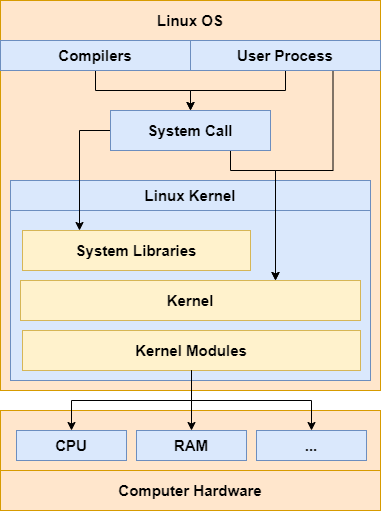

# Belajar Dengan Jenius Linux

## Penulis : Gun Gun Febrianza

## System Programming

---------------------

Gambar di atas adalah **Building Block** dari **OS Linux**. Terdapat komponen **Linux Kernel** sebagai **core**. Pengguna **linux** dapat berinteraksi dengan kernel melalui **System Call**. **System Libraries** adalah sekumpulan fungsi yang dapat digunakan untuk berinteraksi dengan **kernel**. **Kernel** adalah inti dari sistem **linux** yang terdiri dari **scheduler**, **filesystem**, **memory management** dan **networking**.

**Linux Kernel** memiliki kemampuan **Dynamic Linking**, sebuah **kernel module** dapat dimuat ke dalam **kernel** dan dihubungkan (**linked**) pada **kernel** saat **kernel** dalam kondisi berjalan dalam **memory**. **Kernel Module** juga dapat dicabut (**unlinked**) dalam **kernel** kapan saja.

