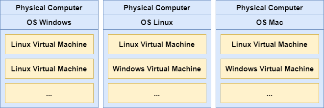
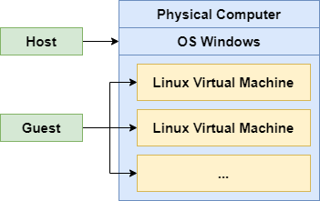
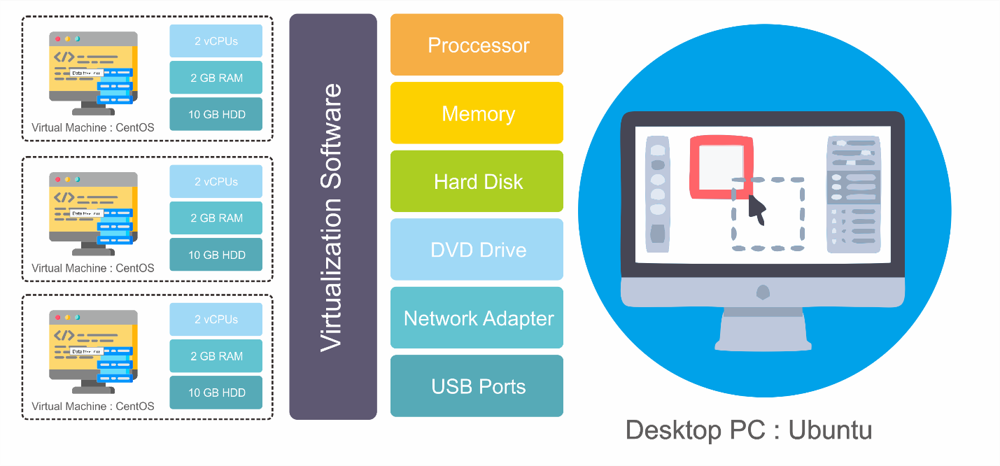

# Belajar Dengan Jenius Linux

## Penulis : Gun Gun Febrianza

# Apa itu Linux Virtual Machine ?

Virtual Machine adalah sebuah komputer virtual yang berjalan di dalam sebuah komputer.

Contoh Linux Virtual Machine adalah kita membuat sistem operasi *linux* berjalan di dalam sistem operasi *windows* yang kita gunakan, maka sistem operasi *linux* disebut sebagai **virtual machine**. 

## Virtual Machine

Sistem operasi windows di sebut sebagai **host** dan sistem operasi linux yang menjadi virtual machine disebut sebagai **Guest**.

Virtual Machine memiliki representasi binary file biasanya dalam format ISO yang dapat kita salin atau pindahkan ke dalam physical computer sehingga menjadi portable.

**Virtual Machine (VM)** dapat berbasis **Full Virtualization** untuk meniru sebuah OS secara keseluruhan. VM diimplementasikan dengan membangun sebuah software layer pada physical machine untuk mendukung sebuah arsitektur mesin secara virtual[11]. 

Gambar di atas adalah ilustrasi kita dapat memiliki 3 Virtual Machine CentOS dalam dekstop PC Ubuntu Linux.

Dalam beberapa literatur Full Virtualization sering juga disebut sebagai *System Virtual* Machine atau Hardware Virtual Machine. Sehingga dalam satu physical server atau physical computer kita dapat membangun Multiple OS Environment sekaligus. 

Untuk mewujudkanya kita memerlukan sebuah ***Hypervisor\***.
